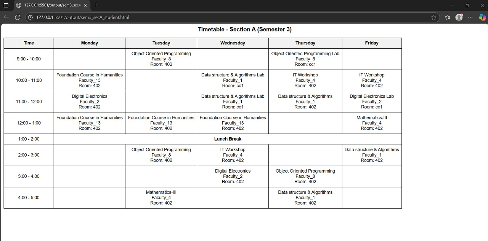
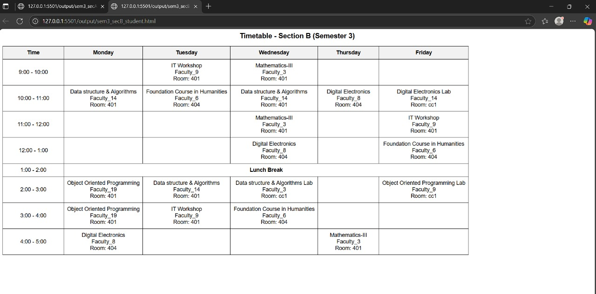
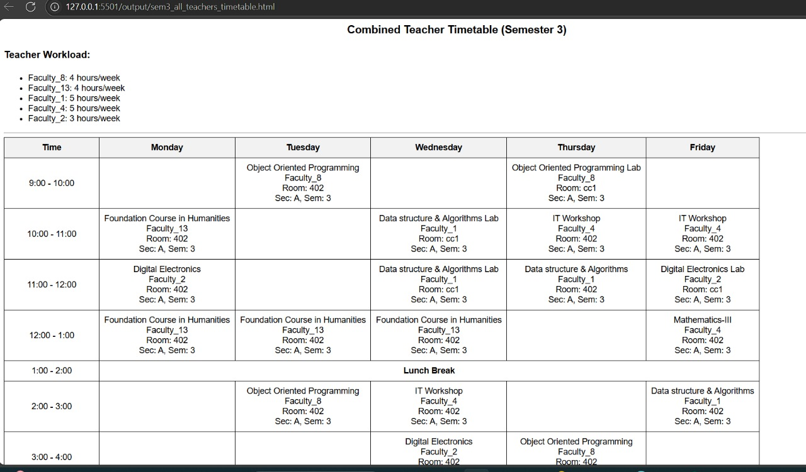

# 🧠 Desktop-Based Timetable Generator (Genetic Algorithm)

A smart and user-friendly timetable generator desktop application built with **PyQt5** and powered by a **Genetic Algorithm**. The app supports **Admin, Teacher, and Student roles**, allowing login, viewing, editing, and downloading timetables.

---

## 💡 Key Features

- 📅 Role-based login system (Admin / Teacher / Student)
- 🧬 Timetable generation using Genetic Algorithm
- 🏫 Input: Custom CSV dataset with faculty, subjects, rooms, etc.
- 🖥️ GUI built using PyQt5
- 🖋️ Edit & Download timetables in HTML format
- 🎯 Constraints handled: no clashes, room availability, lab hours, faculty workload

---

## 🚀 Technologies Used

- Python
- PyQt5
- Pandas, NumPy
- Genetic Algorithm (custom implementation)

---

## 📷 Screenshot

